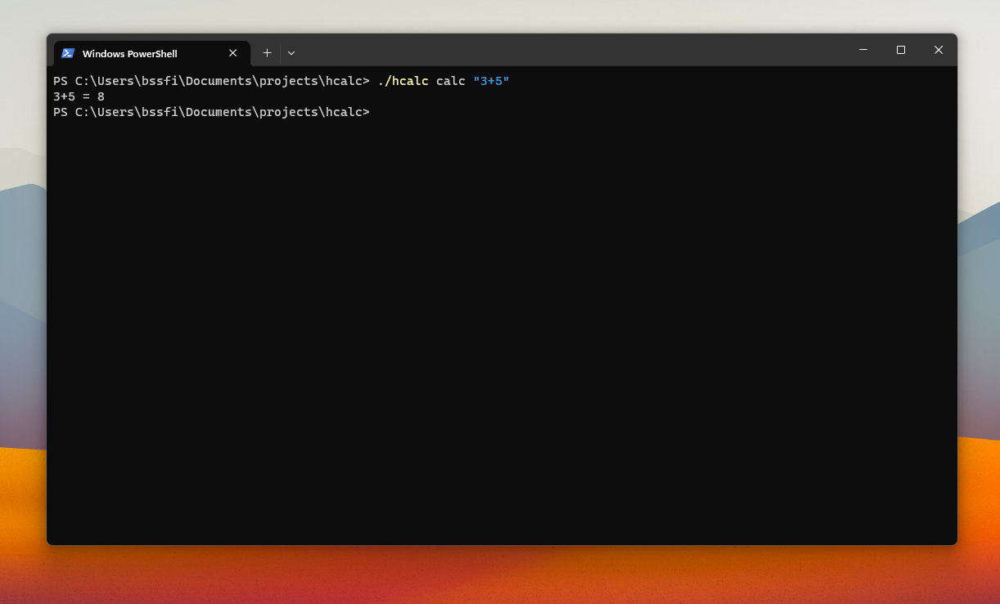

# HCALC

hcalc is a small cli calc made with typescript

## Features

- Eval an mathematical expression
- Save result in file

## Commands

- `calc <exp>` : Evaluate a mathematical expression
- `help`: Show help
- `version`: Show version number
